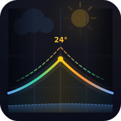

<p align="center">
  
</p>

<h1 align="center">Austria Weather Bot</h1>

<p align="center">
  Daily weather charts for Austrian cities, delivered to Telegram.<br/>
  <a href="https://t.me/wetter_at_bot"><strong>→ Try it live: @wetter_at_bot</strong></a>
</p>

---

A Telegram bot that sends a daily weather chart for your chosen Austrian city. The chart combines temperature, UV index, and rain in one dark-theme visualization — all sourced from the free [Open-Meteo](https://open-meteo.com/) API.

## Features

- Daily weather notification at a configurable time (Vienna timezone)
- 12 Austrian cities to choose from
- Dark-theme chart (00:00 – 24:00) with:
  - **Temperature** — solid line with heat-coloured centre (blue = cold → orange = warm → red = hot), glow halo, and feels-like dashed overlay
  - **UV index** — gradient-coloured dashed line on its own axis, annotated peak
  - **Rain** — dotted line with filled area; heavy rain (≥ 5 mm/h) highlighted separately
  - Night shading (before sunrise / after sunset) and prominent 06 / 12 / 18 h grid markers
  - Hour labels on both top and bottom edges for easy time-reading
- Settings persist across restarts

## Quick start

**1. Create a bot via [@BotFather](https://t.me/BotFather) and copy the token.**

**2. Configure:**

```bash
cp .env.example .env
# paste your token into BOT_TOKEN=
# optionally set ADMIN_CHAT_ID= to receive feedback notifications
```

**3. Run:**

```bash
docker compose up -d
```

## Commands

| Command | Description |
|---|---|
| `/start` | Register and show current settings |
| `/help` | Show all commands |
| `/city` | Pick your Austrian city |
| `/time HH:MM` | Set daily notification time — e.g. `/time 07:30` |
| `/weather` | Get today's chart immediately |
| `/feedback` | Send a suggestion or report an issue |

Default city is **Wien**, default notification time is **07:00** (Europe/Vienna).

## Cities

Wien, Graz, Linz, Salzburg, Innsbruck, Klagenfurt, Wels, St. Pölten, Dornbirn, Bregenz, Villach, Steyr

## Weather data

Powered by [Open-Meteo](https://open-meteo.com/) — free, no API key required.

## Development

```bash
python -m venv .venv
source .venv/bin/activate
pip install -r requirements.txt

BOT_TOKEN=your_token python bot.py
```

User data is stored in `/data/users.json` (or `./data/users.json` locally — set `DATA_DIR=./data`).

## Configuration

| Variable | Required | Description |
|---|---|---|
| `BOT_TOKEN` | Yes | Token from [@BotFather](https://t.me/BotFather) |
| `ADMIN_CHAT_ID` | No | Your Telegram chat ID. When set, every `/feedback` submission is forwarded to you as a Telegram message in addition to being saved to `/data/feedback.log`. Find your ID via [@userinfobot](https://t.me/userinfobot). |
| `DATA_DIR` | No | Path for persistent data (default: `/data`) |
